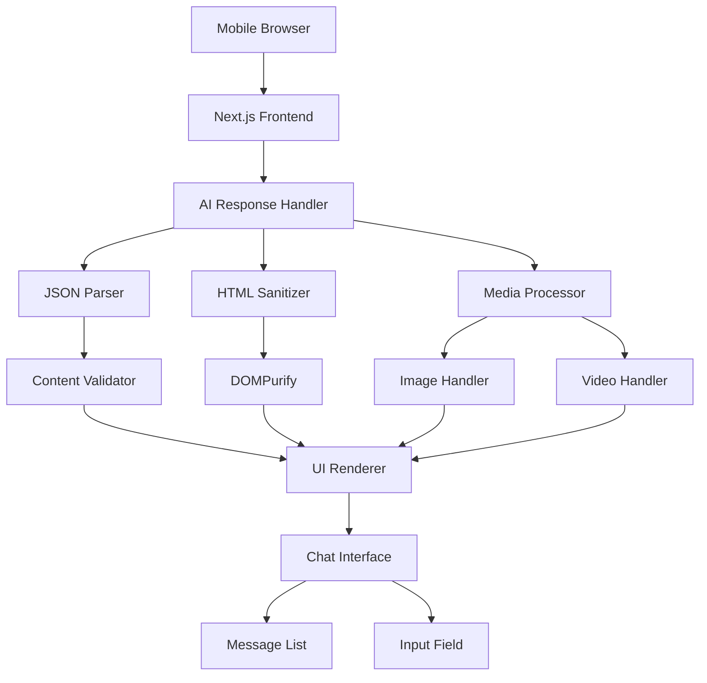

# Design Document: Mobile AI Chatbot

## Overview

This document outlines the design for a mobile-first AI chatbot application that provides a messenger-style interface for linear conversations. The system processes AI responses in JSON format containing HTML text, images, and videos, with specific media display rules and robust security measures.

## Architecture

### High-Level Architecture



### Technology Stack

- **Frontend Framework**: Next.js 14+ with App Router
- **UI Library**: React 18+ with TypeScript
- **Styling**: Tailwind CSS for responsive design
- **Security**: DOMPurify for HTML sanitization
- **State Management**: React useState/useReducer for chat state
- **Mobile Optimization**: CSS Grid/Flexbox with dvh units

## Components and Interfaces

### Core Components

#### 1. ChatContainer Component
```typescript
interface ChatContainerProps {
  initialMessages?: Message[];
  onMessageSend: (message: string) => Promise<AIResponse>;
}

interface Message {
  id: string;
  type: 'user' | 'ai';
  content: string | AIResponse;
  timestamp: Date;
  turnNumber?: number;
}
```

#### 2. MessageList Component
```typescript
interface MessageListProps {
  messages: Message[];
  isLoading: boolean;
}
```

#### 3. MessageInput Component
```typescript
interface MessageInputProps {
  onSend: (message: string) => void;
  disabled: boolean;
  placeholder?: string;
}
```

#### 4. AIMessage Component
```typescript
interface AIMessageProps {
  response: AIResponse;
  turnNumber: number;
}
```

### Data Models

#### AIResponse Interface
```typescript
interface AIResponse {
  html: string; // Required: HTML content with formatting
  image?: MediaContent; // Optional: Image for turn 4
  video?: MediaContent; // Optional: Video for turn 6
}

interface MediaContent {
  src: string;
  alt?: string; // Required for images
  title?: string; // Required for videos
}
```

#### Chat State Model
```typescript
interface ChatState {
  messages: Message[];
  currentTurn: number;
  isLoading: boolean;
  error: string | null;
}

type ChatAction = 
  | { type: 'ADD_USER_MESSAGE'; payload: string }
  | { type: 'ADD_AI_MESSAGE'; payload: AIResponse }
  | { type: 'SET_LOADING'; payload: boolean }
  | { type: 'SET_ERROR'; payload: string | null };
```

### Security Layer

#### HTML Sanitization Configuration
```typescript
interface SanitizationConfig {
  allowedTags: string[];
  allowedAttributes: Record<string, string[]>;
  allowedSchemes: string[];
}

const SANITIZATION_CONFIG: SanitizationConfig = {
  allowedTags: ['h1', 'h2', 'h3', 'p', 'br', 'b', 'strong', 'i', 'em', 'ul', 'ol', 'li', 'a'],
  allowedAttributes: {
    'a': ['href', 'rel', 'target']
  },
  allowedSchemes: ['http', 'https']
};
```

### Mobile Optimization Strategy

#### Viewport Handling
- Use `dvh` (dynamic viewport height) units for iOS Safari compatibility
- Implement Visual Viewport API for keyboard detection
- Apply `transform: translateY()` for input field positioning

#### Responsive Design Patterns
```css
.chat-container {
  height: 100dvh;
  display: flex;
  flex-direction: column;
}

.message-list {
  flex: 1;
  overflow-y: auto;
  padding: 1rem;
}

.input-container {
  position: sticky;
  bottom: 0;
  background: white;
  padding: 1rem;
  border-top: 1px solid #e5e7eb;
}
```

## Correctness Properties

*A property is a characteristic or behavior that should hold true across all valid executions of a system—essentially, a formal statement about what the system should do. Properties serve as the bridge between human-readable specifications and machine-verifiable correctness guarantees.*

### Property 1: Keyboard Layout Adaptation
*For any* mobile device with virtual keyboard, when the keyboard appears or disappears, the system should adjust the layout to keep the input field visible and accessible
**Validates: Requirements 1.3**

### Property 2: Message Submission Universality  
*For any* user input method (click or Enter key) and any message content, the system should successfully submit the message and trigger the next conversation turn
**Validates: Requirements 1.4**

### Property 3: Loading State Visibility
*For any* AI response request, the system should display a loading indicator during the request and hide it when the response is received or an error occurs
**Validates: Requirements 1.5**

### Property 4: Linear Conversation Progression
*For any* user message input, the system should proceed to the next AI response without branching logic, maintaining sequential conversation flow
**Validates: Requirements 2.1, 2.2, 2.3**

### Property 5: Chronological Message Ordering
*For any* sequence of user messages and AI responses, the system should display them in the exact chronological order they were created
**Validates: Requirements 2.4**

### Property 6: JSON Parsing Robustness
*For any* AI response data, the system should successfully parse valid JSON with html, image, and video fields, and handle parsing failures gracefully
**Validates: Requirements 3.1, 3.5**

### Property 7: Required Field Validation
*For any* AI response, the system should validate that the html field is present and reject responses missing this required field
**Validates: Requirements 3.2**

### Property 8: Media Field Validation
*For any* AI response containing image or video fields, the system should validate that images have src and alt properties, and videos have src and title properties
**Validates: Requirements 3.3, 3.4**

### Property 9: HTML Sanitization Security
*For any* HTML content from AI responses, the system should sanitize the content using DOMPurify before rendering, removing all dangerous elements and attributes
**Validates: Requirements 4.1, 6.1**

### Property 10: Safe Tag Allowlist
*For any* HTML content, the system should allow only safe tags (h1, h2, h3, p, br, b, strong, i, em, ul, ol, li, a) and remove all other tags during sanitization
**Validates: Requirements 4.2, 6.2**

### Property 11: Link Security Processing
*For any* HTML content containing links, the system should ensure all anchor tags have href attributes and automatically add rel="noreferrer noopener" and target="_blank" attributes
**Validates: Requirements 4.3**

### Property 12: Dangerous Content Blocking
*For any* HTML content, the system should remove all event handler attributes (onclick, onerror, etc.) and script/style tags to prevent XSS attacks
**Validates: Requirements 4.4, 6.3**

### Property 13: Sanitized HTML Rendering
*For any* sanitized HTML content, the system should render it correctly in the DOM using dangerouslySetInnerHTML while maintaining formatting and structure
**Validates: Requirements 4.5**

### Property 14: Image Accessibility
*For any* image content in AI responses, the system should display the image with proper alt text for screen readers and accessibility compliance
**Validates: Requirements 5.3**

### Property 15: Video Controls Provision
*For any* video content in AI responses, the system should provide standard HTML5 video controls for user playback control
**Validates: Requirements 5.4**

### Property 16: Media Display Constraints
*For any* conversation, the system should display images only at turn 4 and videos only at turn 6, with no more than one of each media type per conversation
**Validates: Requirements 5.5, 5.6**

### Property 17: Media URL Validation
*For any* media content (images or videos), the system should validate URLs before attempting to display content and handle invalid URLs gracefully
**Validates: Requirements 6.4**

### Property 18: Graceful Content Degradation
*For any* HTML content that requires sanitization, the system should render remaining safe content even when dangerous elements are removed
**Validates: Requirements 6.5**

### Property 19: Responsive Layout Adaptation
*For any* screen size change or device orientation change, the system should adapt the layout to maintain usability and proper element positioning
**Validates: Requirements 7.2**

### Property 20: Touch Target Accessibility
*For any* interactive UI element, the system should ensure minimum touch target sizes meet mobile accessibility guidelines (44px minimum)
**Validates: Requirements 7.3**

### Property 21: Content Overflow Handling
*For any* content that exceeds container dimensions, the system should provide appropriate scrolling behavior without breaking the layout
**Validates: Requirements 7.4**

## Error Handling

### Error Categories

1. **Network Errors**: Handle AI service unavailability
2. **Parsing Errors**: Manage malformed JSON responses  
3. **Validation Errors**: Process invalid media URLs or missing required fields
4. **Security Errors**: Block and log potential XSS attempts
5. **UI Errors**: Recover from layout or rendering failures

### Error Recovery Strategies

- **Graceful Degradation**: Continue conversation flow even with partial failures
- **User Feedback**: Provide clear error messages without exposing technical details
- **Retry Logic**: Implement exponential backoff for network failures
- **Fallback Content**: Display safe default content when media fails to load

## Testing Strategy

### Dual Testing Approach

The system will use both unit testing and property-based testing for comprehensive coverage:

**Unit Tests**: Verify specific examples, edge cases, and error conditions
- Test specific turn behaviors (turn 4 image, turn 6 video)
- Test error handling with malformed JSON
- Test UI component rendering with known inputs
- Test integration between components

**Property Tests**: Verify universal properties across all inputs  
- Test HTML sanitization with randomly generated malicious content
- Test conversation flow with random user inputs
- Test responsive behavior with various screen dimensions
- Test media validation with random URL formats

### Property-Based Testing Configuration

- **Testing Library**: fast-check for TypeScript/JavaScript property-based testing
- **Test Iterations**: Minimum 100 iterations per property test
- **Test Tagging**: Each property test tagged with format: **Feature: mobile-ai-chatbot, Property {number}: {property_text}**

### Testing Requirements

Each correctness property must be implemented as a single property-based test that:
1. Generates appropriate random inputs for the property domain
2. Executes the system behavior being tested
3. Verifies the property holds for all generated inputs
4. References the design document property in test comments